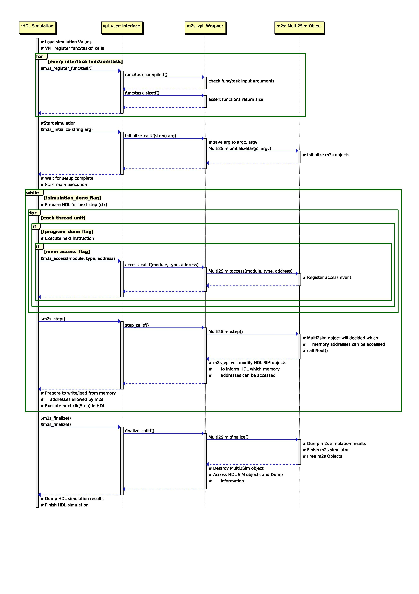
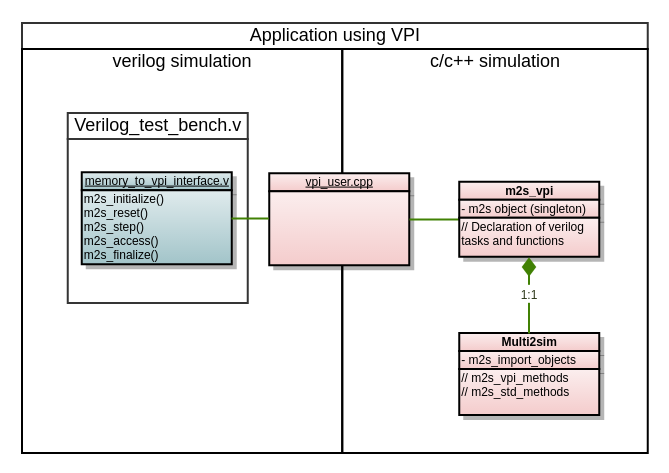
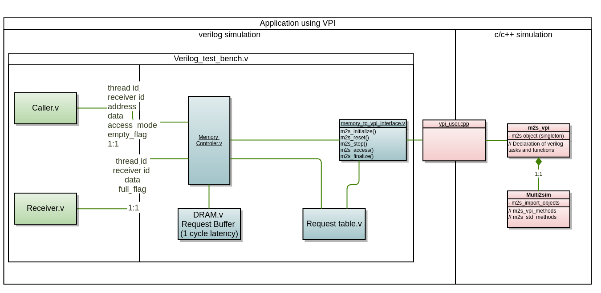

### Multi2Sim Verilog Interface (UNDER DEVELOPMENT)

This branch aims to enable extra functionality for multi2sim simulator:

* Expose multi2sim memory model so it can be used by an external simulated logic written in verilog
* It uses the **Verilog Procedural Interface**, thus it requires a HDL simulator that suports such interface
  * Right now, the project is using ModelSim-Altera as its HDL simulator
* Running on linux 

### Requirements
1. A complete instalation of Quartus-Prime lite: Found at:
http://dl.altera.com/?edition=lite > Updates (tab) > Complete Download (section):

 - Quartus-lite-16.0.2.222-linux.tar Size: 12.2 GB MD5:
   FE3C46D6AA6B3F08AEFF0666796E12EE

2. Some 32-bit libraries and multi2sim **dependencies**

    sudo apt-get install libc6-dev-i386 # solve cdefs.h
    sudo apt-get install libxft2:i386   # some 32bit libraries are necessary
    sudo apt-get install libxext6:i386  # some 32bit libraries are necessary
    sudo apt-get install lib32ncurses5  # some 32bit libraries are necessary
    sudo apt-get install gcc-multilib g++-multilib
    sudo apt-get install m4
    sudo apt-get install automake
    mv YOUR_ALTERA_PATH/modelsim_ase/gcc-4.7.4-linux/lib/libstdc++.so.6 YOUR_ALTERA_PATH/modelsim_ase/gcc-4.7.4-linux/lib/libstdc++.so.6.BACKUP #Force to use system libstdc++ in case of error

### Installation procedure 
1. `git clone https://github.com/agostini01/multi2sim.git` 
  * Take note of where this project has been saved
2. Download and Install quartus-prime
  * Take note of where quartus-prime was installed
3. Follow multi2sim steps to compile the software (install multi2sim **dependencies**)
  * http://www.multi2sim.org/development.html
  * `~/multi2sim$ libtoolize
~/multi2sim$ aclocal
~/multi2sim$ autoconf
~/multi2sim$ automake --add-missing
~/multi2sim$ ./configure --enable-debug
~/multi2sim$ make`
4. Navigate to `~/multi2sim/m2svpi` and edit the path for your multi2sim and modelsim_ase for all the entries
  * `IDIR =/home/USERNAME_HERE/altera_lite/16.0/modelsim_ase/include
MODELSIM=/home/USERNAME_HERE/altera_lite/16.0/modelsim_ase/linuxaloem
MULTI2SIM=/home/USERNAME_HERE/multi2sim/multi2sim/src
...
etc`
5. You should be able to compile from within `~/multi2sim/m2svpi`. If everything is properly installed `make all` will compile the interface and take you to a modelsim simulation:

    \$# 10.4d
    
    \$ # vsim -c -pli "vpi_interface.sl" top 
    \$ # Start time: 13:28:21 on Sep 22,2016
    \$ # Loading work.top
    \$ # Loading work.addbit
    \$ # Loading ./vpi_interface.sl
    \$ # VPI::In m2s_step_compiletf call
    \$ # VPI::In m2s_step_compiletf call
    \$ # VPI::In m2s_step_compiletf call
    \$ # VPI::In m2s_step_compiletf call
    \$ # VPI::In m2s_initialize_compiletf call
    \$ # VPI::In m2s_reset_compiletf call
    \$ # VPI::In m2s_access_compiletf call
    \$ # VPI::In m2s_access_compiletf call
    \$ # VPI::In m2s_finalize_compiletf call
    VSIM 1> 

Type `1` and hit `enter` to make the simulation run for 1 second

    \$ ; Multi2Sim 5.0 - A Simulation Framework for CPU-GPU Heterogeneous Computing
    \$ ; Please use command 'm2s --help' for a list of command-line options.
    \$ ; Simulation alpha-numeric ID: 1bsfk
    \$ #                                                                                                         --si-sim detailed --si-config si-config --mem-config mem-si-1 --si-report si_report --mem-report mem_report --trace trace.gz --mem-debug debug.mem outM2S
    \$ # VPI::In m2s_initialize_calltf call
    \$ # M2S::vpiInitialize()
    \$ # M2S::WelcomeMessage Function
    \$ # M2S::HERE!!!!

Type `10` and hit `enter` to make the simulation run and finish

### Target sequence diagram:

### Steps of implementation

#### Step 0 (under development)

Isolate Memory Model

#### Step 1 (under development)                                                 
                                                                                
Verilog testbench will configure the memory object during m2s_initialize(). Accesses will be issued - m2s_access() - at different clock cycles. At each clock cycle the testbench will call m2s_step(), this function will update modules structures in accordance to m2s resolved events.
                                                                                
                                                    
                                                                                
#### Step 2 (not started)                                                       
                                                                                
Implementation of a memory controller to interface with a single computing unit communicating its accesses with m2s.
                                                                                

### TO-DOs

 - Isolate the memory model from its dependencies; 
 - link the functions called by the vpi, with actual functions on m2s;
 - Implement a proper test bench.

